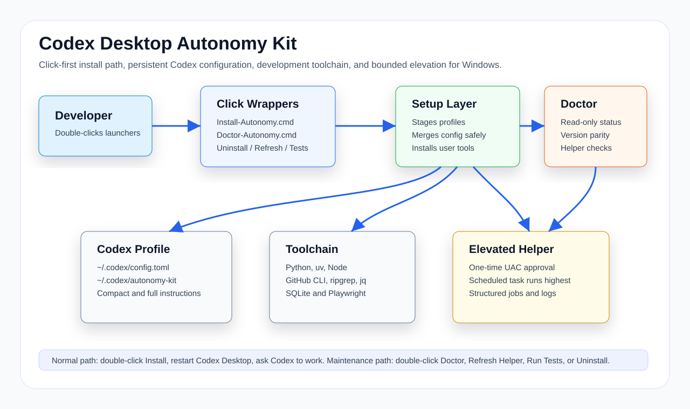

# Codex Desktop Autonomy Kit User Manual

Version 1.7.0 for Windows.

## Overview

Codex Desktop Autonomy Kit is a Windows setup kit for people who want Codex Desktop to act
as a more capable local development collaborator. It installs common development tooling,
stages persistent Codex instruction profiles, creates or refreshes a kit-managed Codex
configuration, and provides a bounded elevated helper for development tasks that need
administrator rights.

The normal workflow is click-first. You should not need to run command-line commands to
install, check, refresh, test, or uninstall the kit.

See [`SECURITY.md`](../SECURITY.md) for the reporting path and the single-owner threat-model
boundary of the elevated helper.

## What Gets Installed

- `~/.codex/config.toml` when no custom config exists, or when the existing config is
  clearly kit-managed.
- `~/.codex/autonomy-kit/` containing the staged compact profile, full profile, config
  example, staging manifest, and (when an existing config is replaced) a kit-owned backup
  manifest.
- User-scope development tools when missing: Python, uv, Node.js, GitHub CLI, ripgrep, jq,
  SQLite, and Playwright.
- Optional elevated helper under `C:\dev\CodexElevatedHelper` after you approve Windows UAC.
- A capability self-assessment rule appended to `~/.codex/AGENTS.md` inside marker comments,
  so every session is told to probe its access rather than assert untested limits.
- The `capability-check` skill under `~/.codex/skills/capability-check/`.

## Capability Self-Assessment

The kit installs a rule and a skill whose whole job is to stop the agent inventing a limit
it never tested.

Why it matters: an agent that believes it cannot write outside its workspace will ask for
permission it does not need, or hand back a blocker that is not real. That costs more time
than almost any other failure mode. Telling the agent "you have access" does not reliably
fix it -- a model can rationalize past an instruction. A probe does fix it, because a probe
produces evidence.

What lands on your machine:

- `~/.codex/skills/capability-check/SKILL.md` -- the probe protocol and reporting format.
- A rule appended to `~/.codex/AGENTS.md`, inside begin/end marker comments. It is added
  only when absent, a backup is taken first, and any content you wrote there is never
  rewritten. Re-running setup when the block is already current changes nothing.
- A matching section in `CODEX-Desktop-Core.md`, so the rule travels with the profile.

The rule separates three cases, which is the part that makes it useful:

| Case | What it looks like | Correct response |
|------|--------------------|------------------|
| Policy veto | `rejected: blocked by policy`, before the shell runs | Spelling problem. Reformat and retry, e.g. `cmd /c rd /s /q` instead of `Remove-Item -Recurse -Force`. |
| Real limit | ACL denial, UAC declined, file lock, missing tool | Genuine. Name the exact error and continue everything else. |
| Imagined limit | Assumed sandbox, workspace-only scope, permission never checked | The common case. Test it instead of asserting it. |

To invoke it deliberately, say **"capability check"**, or use the **`$capability-check`**
skill. Doctor reports whether the rule and skill are present.

Uninstall removes only the kit-authored block from `AGENTS.md`, keeping your own text, and
removes the installed skill.

## Click-First Controls

- `Install-Autonomy.cmd` installs or updates the kit, runs Doctor, and offers to refresh the
  elevated helper if it is stale.
- `Doctor-Autonomy.cmd` shows a read-only status report.
- `Refresh-ElevatedHelper.cmd` refreshes the elevated helper and asks for UAC approval.
- `Run-Tests.cmd` runs the shipped test suite.
- `Uninstall-Autonomy.cmd` turns the kit off by restoring/removing the Codex config layer
  and staged profiles. It asks separately whether to unregister the elevated helper task.
  It always leaves general tools and helper files in place.

## Install

1. **Back up your Codex config** if you already have one:
   `Copy-Item "$env:USERPROFILE\.codex\config.toml" "$env:USERPROFILE\.codex\config.toml.my-backup"`.
   Setup backs up before any overwrite it performs and never replaces a config it did not
   generate, but an independent copy is the one you control. When it overwrites an existing
   config, it records the backup path and SHA-256 under
   `~/.codex/autonomy-kit/config-backup-manifest.json`.
2. Download or clone the repo.
3. Double-click `Install-Autonomy.cmd`.
4. Approve Windows UAC if the helper installer appears.
5. Restart Codex Desktop.

The uv and Scoop bootstrap scripts are downloaded to temporary files and run only when they
match the release-pinned SHA-256 values in `Setup-Autonomy.ps1`. A missing pin or a changed
download is refused rather than executed.

After restart, there is no special invocation phrase. The kit is active through Codex
Desktop's config file and persistent developer instructions.

## Check Status

Double-click `Doctor-Autonomy.cmd`.

Doctor reports:

- toolchain paths,
- whether `~/.codex/config.toml` is present and kit-managed,
- whether autonomy settings are active,
- whether staged profile files are current,
- whether duplicate top-level TOML keys are likely,
- elevated helper task state,
- helper queue/result/log directory availability,
- installed helper script parity against the repo copy.
- whether the `AGENTS.md` capability rule and the `capability-check` skill are installed.

Doctor does not create directories or write probe files. It is a read-only status check.

## Update

Pull or download the latest repo version, then double-click `Install-Autonomy.cmd`.

Setup replaces `config.toml` only when the file is provably kit-owned: it matches the exact
generated template (optionally differing only in the kit's own version comment line), or you
passed `-ForceConfig`. Any other file is left byte-for-byte unchanged, including a config that
has the kit marker but which you have edited since -- setup reports that case and leaves it
alone. When it does overwrite, it backs up first.

Setup never uses substring or "looks like a template" heuristics to decide ownership. v1.6.1
fixed exactly that defect; see the changelog.

## Uninstall

Double-click `Uninstall-Autonomy.cmd`.

This turns the kit off for Codex Desktop by restoring only the backup recorded in
`~/.codex/autonomy-kit/config-backup-manifest.json`. The manifest includes the expected path
and SHA-256, so uninstall never chooses an unrelated newest `config.toml.bak-*` file. If no
valid kit-owned backup exists, a clearly kit-managed config is removed; an invalid manifest
leaves the active config in place for manual review. It also removes staged files from
`~/.codex/autonomy-kit`.

It removes only the kit-authored block from `AGENTS.md`, keeping any content you wrote there,
and removes the installed `capability-check` skill.

It does not remove Python, Node.js, GitHub CLI, ripgrep, jq, SQLite, Playwright, or the
helper files under the helper install root (default `C:\dev\CodexElevatedHelper`). Those
are intentionally left alone because they may be useful outside this kit. The scheduled
task is removed only if you answer yes to the separate prompt.

## Elevated Helper

Codex Desktop may run as a normal user process even when a development task needs elevated
Windows rights. The optional helper solves that with a one-time owner-approved scheduled
task that runs with highest privileges.

The helper accepts structured jobs only. Current supported actions are:

- `CheckAdmin`
- `WingetInstall`
- `WingetUpgrade`
- `RunTrustedPowerShellScript`
- `StartService`
- `StopService`
- `RestartService`
- `OpenDevFirewallPort`
- `RegisterDevScheduledTask`

One supported action, `RunTrustedPowerShellScript`, runs any PowerShell script found under a
trusted development root, with arguments you supply, from a task at highest privilege. The
path check refuses junction and symlink escapes, but the capability itself is broad by
design.

The helper is powerful by design. It is intended for single-owner development machines where
the owner wants Codex to complete local setup, service, SDK, firewall, and toolchain tasks
without repeated UAC prompts after the helper is installed.

## Files And Responsibilities

- `CODEX-Desktop-Core.md` is the compact daily instruction profile.
- `GEN5-Codex-Desktop-Autonomous-Software-Development.md` is the deeper operating profile
  for broader work.
- `config.autonomy.example.toml` is the manual merge template for custom Codex configs.
- `Setup-Autonomy.ps1` does the real setup work behind `Install-Autonomy.cmd`, including
  fail-closed bootstrap hash verification and kit-owned config-backup recording.
- `Doctor-Autonomy.ps1` does the read-only status work behind `Doctor-Autonomy.cmd`.
- `Uninstall-Autonomy.ps1` does the scoped uninstall work behind `Uninstall-Autonomy.cmd`.
- `elevated-dev-helper/` contains the optional scheduled-task helper.
- `~/.codex/autonomy-kit/helper-root.json` records where the helper was installed, so
  Setup, Doctor, and the install launcher look in the same place instead of assuming
  `C:\dev`.
- `tests/` contains five shipped regression and capability checks, including the behavioral
  trusted-path and hardcoded-path gates.
- `skills/capability-check/` is the shipped skill for testing your own access.
- `templates/AGENTS-capability-section.md` is the rule the installer appends to `AGENTS.md`.

## Versioning

The current public release is v1.7.0. Setup writes the same version into the staged manifest
at `~/.codex/autonomy-kit/manifest.json`.

## Safety Notes

- **Back up `~/.codex/config.toml` before installing on a machine whose setup you care
  about.** Setup backs up before any overwrite it performs, but an independent copy costs
  nothing and is the thing you would want if anything at all goes wrong.
- Read scripts before installing on a machine you care about.
- Do not commit machine-specific helper logs, queued jobs, secrets, or tokens.
- Keep the helper on development machines you control.
- Higher-priority Codex, project, OS, legal, and safety rules still apply.
